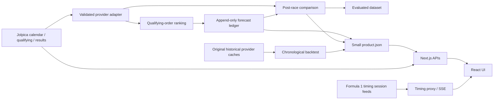

# PitWall

An independent Formula 1 data product: current schedules, published classifications,
session timing, and reproducible race rankings. **No win probabilities or confidence
percentages are published.**

## Current product

- Current race selection uses the live Jolpica calendar, UTC timestamps and published
  results. An expired saved prediction cannot become the current race.
- Session timing uses the Formula 1 session index and static feeds. A real source
  packet timestamp is required for a **live** label. Archived and unknown states
  are explicit; another race is never substituted for a failed selection.
- The production forecast is a **post-qualifying classification ranking** using
  qualifying order. It is a simple baseline with no fitted parameters.
- Captures are immutable. Result comparisons are separate, versioned records.
- The older weighted/probability engine is quarantined research code. Its generated
  files are not served by the application. Legacy rankings are available as
  **unverified history**, excluded from measured forecast performance.

The stale Italian GP bug and the reasons for this boundary are documented in
[the reliability audit](docs/RELIABILITY_AUDIT.md).

## Setup

Use Python 3.11 and Node.js 24 LTS. No credentials are required for the active product.

```sh
python3.11 -m venv .venv
source .venv/bin/activate
pip install -r requirements.txt -r requirements-dev.txt
python -m pitwall.publish --backtest
cd frontend
npm ci
npm run dev
```

Open http://localhost:3000. `--backtest` reconstructs historical experiments from
original provider JSON already present in `data_cache/http`; it does not invent
historical forecasts or retrieve future information. Ordinary scheduled runs use
`python -m pitwall.publish` and preserve the reviewed report.

For a production build, run `npm run build` and `npm start` inside `frontend`.
`python f1_briefing.py` now delegates to the same safe publisher. Old `--force-retrain`
and model mutation switches are intentionally unavailable on that command.

## Architecture



### Important boundaries

| Module | Responsibility |
|---|---|
| `pitwall/data/jolpica.py` | HTTP timeout, five-minute cache, schema/pagination validation, UTC calendar identity |
| `pitwall/models/ranking.py` | Deterministic shared prediction function and classification metrics |
| `pitwall/models/ledger.py` | Atomic append-only captures, immutable evaluation revisions, evaluated dataset |
| `pitwall/models/backtest.py` | Chronological retrospective comparison and promotion eligibility |
| `pitwall/publish.py` | Scheduled publication; isolated legacy archive and original FIA source metadata |
| `frontend/app/api/_lib/contracts.js` | Validate the product contract, refresh calendar/results, expire old predictions at request time |
| `frontend/app/api/f1timing` | Preserve selected session identity; packet freshness and bounded caching |
| `frontend/app/components/ProductViews.jsx` | Overview, ranking, results, methodology and source views |

The browser also expires a displayed forecast at its scheduled start. This protects
an open tab if the scheduled publisher stops. If the calendar provider is unavailable,
the app does not choose a current race from old artifacts. Schedule passage is an
**UPDATING** state, never proof that a race is live or completed.

## Prediction methodology

See [MODEL_REPORT.md](MODEL_REPORT.md) for the full protocol, actual measured
comparison, excluded races, leakage boundaries and promotion criteria.

The forecast orders the published qualifying field. It predicts final classification
order, including non-finishers, not race pace or win probability. It ignores grid
penalties, tyre choices, weather and mechanical reliability. It is deliberately
simple because the previous final blended predictor had no defensible validation.

A candidate combines qualifying rank and prior-five-result form rank with equal
weight. On the reconstructed 2024–2025 test period it failed the improvement gate.
It was not promoted. Production is not advertised as machine learning or self-learning.

### Capture → evaluation → improvement

1. Fetch the event calendar and qualifying classification before race start.
2. Persist event ID, model/feature version, capture time, cutoff, raw qualifying
   input, input hash and provider retrieval evidence in `data_cache/ledger/predictions`.
3. After a complete matching result exists, save an evaluation under
   `data_cache/ledger/evaluations`. A correction creates another revision.
4. Export one final captured forecast and latest result revision per race to
   `data_cache/evaluated-dataset.json`. Missing/substituted entrants are flagged,
   not silently dropped from the metric denominator.
5. Develop a candidate on older races, reserve later races, compare against the
   same baseline field and apply the documented gate. Promotion requires a reviewed
   version change. No scheduled process mutates weights or replaces production.

There are currently no genuine forecasts from this new lifecycle to evaluate.
The 19 saved legacy briefings cannot be retroactively repaired into valid captures.
The model page distinguishes reconstructed experiments from prospective records.

## Validation

```sh
.venv/bin/ruff check f1_briefing.py pitwall scripts tests
.venv/bin/pytest -q
.venv/bin/python scripts/validate_product.py
cd frontend
npm run lint
npm run format:check
npm run test:unit
npm run build
npx playwright install chromium webkit
npm test
npm audit --audit-level=high
```

Browser tests use isolated synthetic fixtures for loading, failure, unavailable,
live and historical states. No production module imports those fixtures. They run
at 1440×1000, 1280×800 and 390×844, including mobile WebKit, with extra
320 px, keyboard, axe accessibility and reduced-motion checks. See [validation evidence](docs/VALIDATION.md)
for executed outcomes and critic history; commands alone are not proof of success.
The [stricter review](docs/CRITIC_9_REVIEW.md) and [frontend critic](UI_AUDIT.md)
record the subsequent 2026-09-18 pass.

## Deployment and operations

- Deploy the `frontend` directory as a Node.js Next.js app. The tracing configuration
  includes `../data_cache/product.json` in the build artifact.
- The independent scheduled workflow publishes hourly. It commits only
  the small product, evaluated dataset and append-only ledger. It fails on write
  conflicts; it does not rewrite history or force a rebase resolution.
- For separately hosted data, configure `PITWALL_DATA_BASE_URL` to an explicitly
  trusted HTTPS directory. There is no implicit GitHub fallback to a different
  version. A corrupt local contract fails closed.
- Existing deployments must redeploy these code changes. Local validation does not
  update `pitwall.shreybuilds.com`, and repository settings/branch protection may
  require enabling workflow pushes or deploying the scheduled data independently.
- Keep ledger files in persistent storage and backups. An ephemeral filesystem must
  not be the sole copy. A SQLite legacy database is not the new forecast ledger.
- Inspect failed publisher workflow runs. Provider errors appear in the published
  warnings; structural/ledger errors fail the run visibly.

See [RUNBOOK.md](RUNBOOK.md) and [.env.example](.env.example). The active product has
no email/issue notification side effects. Legacy notification and AI adapters are
retained for research; they are not invoked by production publication.

## Data and limits

[DATA_SOURCES.md](DATA_SOURCES.md) records sources, freshness, failure behavior and
usage constraints. Jolpica is a community provider; FIA documents are authoritative
for official sporting decisions. F1 timing is an undocumented service and may be
unavailable or change schema. No availability SLA is implied.

Sprint schedules are supported. A validated sprint ranking model, weather forecast,
strategy optimization, calibrated probabilities and an autonomous model-training
system are not available. During a live event, use the timing page; the overview
will not infer live activity from a scheduled start time.

## Attribution

PitWall retains its original [MIT license](LICENSE). Provider data and Formula 1/FIA
names, images, audio and documents retain their owners' rights. Open source code
licensing does not grant rights to redistribute provider content. PitWall is not
affiliated with Formula 1 or the FIA.

## Latest release review

See [September 28 release review](docs/RELEASE_REVIEW.md) for Strategy, mobile
timing, 12-hour IST, prospective evaluation evidence and the current critic score.
